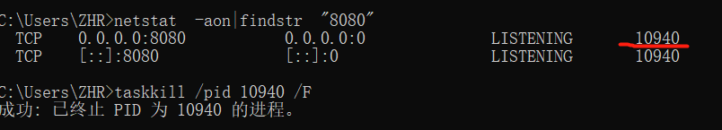

# JavaScript

> 学习改变人生，习惯成就事业。

---

## 目录

- [js](https://github.com/ZHR63/JavaScript/blob/master/data/js)
- [Vue](https://github.com/ZHR63/JavaScript/blob/master/data/vue)
- [CSS](https://github.com/ZHR63/JavaScript/blob/master/data/css)
- [npm](https://github.com/ZHR63/JavaScript/blob/master/data/npm)
- [node](https://github.com/ZHR63/JavaScript/blob/master/data/node)

### window 中查找端口并关闭

**1.查找端口占用的进程信息**

    netstat  -aon|findstr  "8080"

**2.关闭 8081 对应的进程号**

    taskkill /pid 10940 /F

### [谷歌访问助手](https://www.jianshu.com/p/6086ec29c173)

### [ES6 完全使用手册](https://juejin.im/post/5bfe05505188252098022400)

### [Markdown 在线编辑器](https://www.mdeditor.com/)

### [鬼灭之刃](https://www.mkzhan.com/209827/)

### [React.js 小书](http://huziketang.mangojuice.top/books/react/)

### [vant](https://youzan.github.io/vant/#/zh-CN/intro)

### [JS 前 20 个常用字符串方法及使用方式](https://juejin.im/post/5d6866936fb9a06ada54c642)

### [JavaScript 数组的十八般武艺](https://juejin.im/post/5b684ef9e51d451964629ba1)

### [11 道浏览器原理面试题](https://juejin.im/post/5d89798d6fb9a06b102769b1)

### [这 44 个 CSS 精选知识点你能在 30 秒内给出答案吗？](https://juejin.im/post/5d40120f6fb9a06b0471d956)

### [vue-cli 脚手架搭建项目及 Axios 封装](https://juejin.im/post/5d89c75651882509662c55b1)

### [构建react项目失败解决办法](https://www.cnblogs.com/quitpoison/p/10310688.html)

### [蓝湖](https://lanhuapp.com/web/#/item/project/board?pid=4af96535-94dc-42fd-ad12-c626f7bc8aa4)

### [老师申请](https://easydoc.top/?#/doc/34814434/mJD6rVID/sblVICfw)

### [谷歌小助手](https://segmentfault.com/a/1190000020548973?utm_source=tag-newest)

### [我的估价](https://easydoc.xyz/#/doc/31650716/5GkCCPBw/2ariUmFk)
