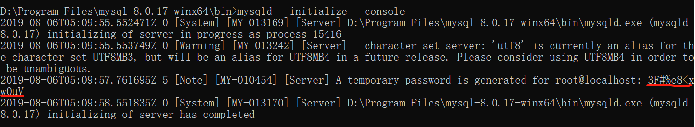
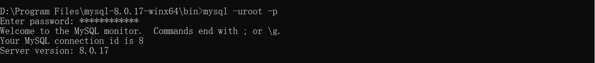

# Mysql

## mysql 安装(`8以上版本`)

1.  [mysql 下载](https://dev.mysql.com/downloads/mysql/)

2.  解压安装到 d 盘，创建 my.ini 文件

    `basedir, datadir` 是你 mysql 的存放路径

```
[mysql]
# 设置mysql客户端默认字符集
default-character-set=utf8

[mysqld]
#设置3306端口
port = 3306

# 设置mysql的安装目录
basedir=D:\Program Files\mysql-8.0.17-winx64
# 设置mysql数据库的数据的存放目录
datadir=D:\Program Files\mysql-8.0.17-winx64\myData

# 允许最大连接数
max_connections=200

# 服务端使用的字符集默认为UTF8
character-set-server=utf8

# 创建新表时将使用的默认存储引擎
default-storage-engine=INNODB

# 默认使用“mysql_native_password”插件认证
default_authentication_plugin=mysql_native_password

[client]
# 设置mysql客户端连接服务端时默认使用的端口和默认字符集
port=3306
default-character-set=utf8
```

3. 配置环境变量

   **_将 mysql 的存放路径 添加到 path 中_**

   例如 ： `D:\Program Files\mysql-8.0.17-winx64\bin`

4. cmd 以管理员运行，进入 mysql 的 bin 目录

   

5. 运行 mysqld --initialize --console

   这是你的初始密码，一定要记下来

   

6. mysqld install

   会提示服务安装成功

   

7. 启动 mysql 服务器 net start mysql

   

8. 运行 `mysql -uroot -p` 然后输入初始密码

   

9. 修改自己的密码

   `ALTER USER 'root'@'localhost' IDENTIFIED BY 'root'`

10. 退出 mysql

    `exit`

11. 关闭 mysql 服务器

    `net stop mysql`
