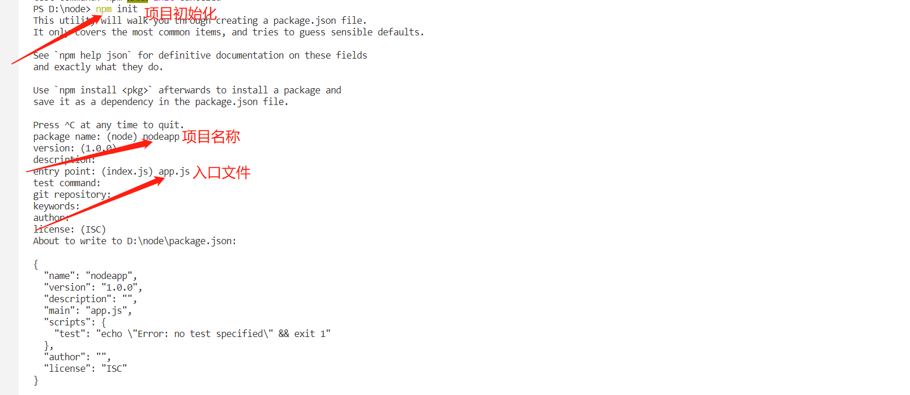
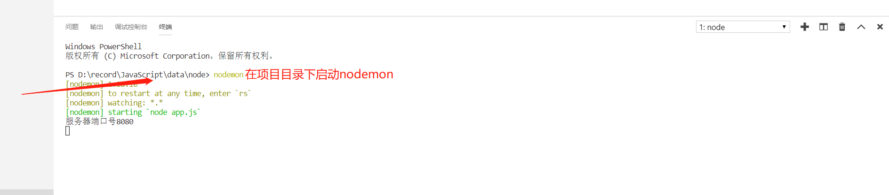

# node

## 目录
* [npm查看全局安装路径](#npm查看全局安装路径)
* [vscode配置node环境](#vscode配置node环境)

### npm查看全局安装路径

    npm root -g

<br>

### vscode配置node环境

vscode 安装插件 code runner

    https://juejin.im/post/5c1f8e52f265da6170071e43

<br>

### 创建node项目
    
    npm init



1.安装express

    npm install express --save

2.创建一个app.js文件

```javascript
const express = require('express');

// 实例化对象
const app = express();

// 配置路由
app.get("/", (req, res) => {
    res.send("再见");
})

app.get("/about", (req, res) => {
    res.send("关于");
})

// 监听端口
const port = 8080;

app.listen(port, () => {
    console.log(`服务器端口号${port}`);
});
```

3.node实时预览

    cnpm install -g nodemon

4. 启动nodemon




### 模板引擎handlebars

为什么使用handlebars，因为和使用差不多

`安装`

    cnpm install express-handlebars

